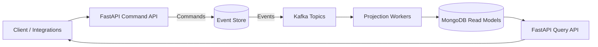
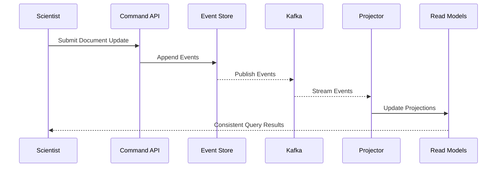
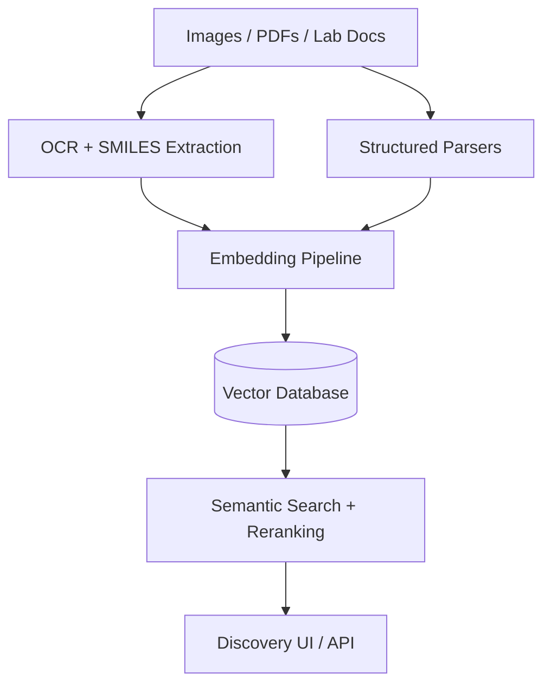

# DAIKON DOCU STORE

A human-first document intelligence store for drug discovery, built to keep scientific work explainable, searchable, and ready for the next breakthrough.

## Status

## Why it exists

Drug discovery generates a river of documents: experimental protocols, assay results, regulatory artifacts, and research narratives. Docu Store exists to keep that river navigable. We want a system where every update is traceable, every decision is defensible, and every insight is easy to rediscover.

## Capabilities

- **Event-sourced core** for durable provenance and rollback analysis.
- **CQRS read models** tuned for search, dashboards, and review flows.
- **Streaming integration** via Kafka to connect lab systems and pipelines.
- **API-first architecture** built on FastAPI.
- **AI-powered enrichment (in progress)**: OCR extraction of SMILES from images and PDFs, document embeddings across formats, and a vector database for semantic retrieval.

## Architecture at a glance

## Event lifecycle

## Intelligence roadmap

Docu Store is in active development. The vision is to pair trustworthy data lineage with modern retrieval so scientists can move from “where is that file?” to “what does it imply?” in seconds.

## What makes it intelligent

- **Context-aware history**: every document state is derived, not overwritten.
- **Separation of concerns**: write paths stay correct, read paths stay fast.
- **Composable signals**: events and embeddings become reusable blocks for analytics.
- **Search that feels human**: semantic retrieval that understands chemistry artifacts and experimental context.
- **Operational clarity**: streaming pipelines are explicit, observable, testable.

## Next steps

- Skim `TESTING_QUICK_REFERENCE.md` for a fast local setup.
- Review `WORKER_SETUP.md` for projector and worker configuration.

## Features

- Event sourcing architecture
- CQRS pattern for read/write separation
- Kafka for event streaming
- MongoDB for read models
- FastAPI for REST API
