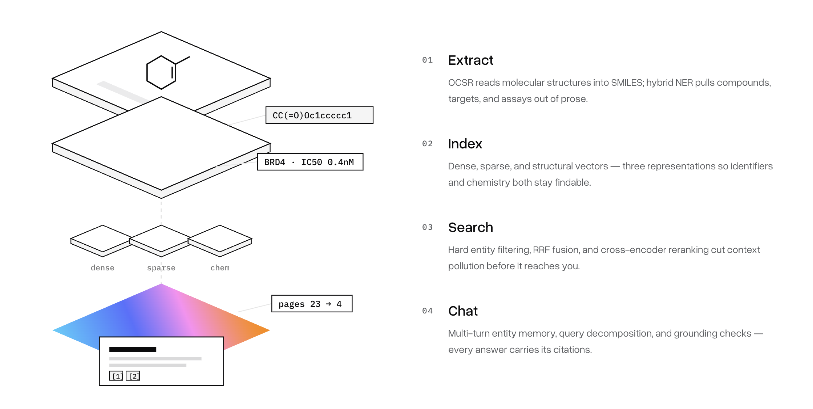

<p align="center">
  
</p>

<h1 align="center">DocuStore</h1>

<p align="center">
Document intelligence for drug discovery. Event-sourced, AI-enriched, built to keep scientific work explainable, searchable, and ready for the next breakthrough.
</p>

<p align="center">
  <a href="https://github.com/sidxz/docu-store/actions/workflows/tests.yml"></a>
  <a href="https://www.python.org/"></a>
  <a href="https://nextjs.org/"></a>
</p>



## Architecture

```
                                    +------------------+
                                    |   Next.js 16     |
                                    |   Portal (web)   |
                                    +--------+---------+
                                             |
+----------------+    +---------+    +-------v--------+    +----------------+
| EventStoreDB   |<-->| FastAPI |<-->|   MongoDB      |    | Qdrant         |
| (event store)  |    | (API)   |    | (read models)  |    | (vectors)      |
+-------+--------+    +----+----+    +----------------+    +-------+--------+
        |                  |                                       |
        v                  v                                       |
+-------+--------+  +-----+------+                                |
| Read Worker    |  | Pipeline   |     +------------------+       |
| (projections)  |  | Worker     +---->| Temporal         +-------+
+----------------+  | (triggers) |     | CPU/LLM Workers  |
                    +-----+------+     +------------------+
                          |
                    +-----v------+
                    | Kafka      |
                    | (plugins)  |
                    +------------+
```

**Backend** (`services/`): Python, FastAPI, event sourcing (EventStoreDB), CQRS (MongoDB), Temporal workflows, Qdrant vector search, Kafka event streaming.

**Frontend** (`web/`): Next.js 16, shadcn/ui + AI Elements, Tailwind v4, TanStack Query, pnpm monorepo.

**CLI** (`cli/`): [`@docu-store/cli`](https://www.npmjs.com/package/@docu-store/cli) — upload, search, and chat with documents from the terminal.

**6 backend processes** from a single image:

| Process | Purpose |
|---------|---------|
| API | FastAPI server (port 8000) |
| Read Worker | Event projections to MongoDB |
| Pipeline Worker | Event-driven workflow triggers |
| Temporal Worker | Embeddings, compound extraction (CPU-bound) |
| LLM Worker | Summarization, NER, metadata extraction |
| Plugin Consumer | Kafka-to-Temporal plugin bridge |

## Quick Start (Development)

**Prerequisites**: Docker, Python 3.12+, uv, Node.js 22+, pnpm

```bash
# 1. Start infrastructure (Mongo, EventStoreDB, Kafka, Temporal, Qdrant, Langfuse, Umami)
cd services
make docker-up

# 2. Install backend dependencies
make dev-install

# 3. Start all backend services
make run-all

# 4. Start frontend (separate terminal)
cd web
pnpm install
pnpm dev
```

**Services**:
- API: http://localhost:8000
- Portal: http://localhost:15000
- EventStoreDB UI: http://localhost:2113
- Temporal UI: http://localhost:8233
- Kafka UI: http://localhost:5051
- Qdrant: http://localhost:6333/dashboard
- Langfuse: http://localhost:3000
- Umami: http://localhost:3001

## Docker Images

Both images are universal (config via environment variables at runtime).

| Image | Registry |
|-------|----------|
| `ghcr.io/sidxz/docu-store` | Backend (all 6 processes) |
| `ghcr.io/sidxz/docu-store-web` | Frontend (Next.js standalone) |

### Build locally

```bash
cd services && make docker-build      # backend
cd services && make docker-build-web  # frontend
```

### Publish (via GitHub Actions)

Use the release helper — it bumps the version file, commits, tags, and pushes (CI rejects tags that don't match the version file):

```bash
./scripts/release.sh                    # interactive
./scripts/release.sh services patch     # backend
./scripts/release.sh web minor          # frontend
./scripts/release.sh cli patch          # CLI (publishes to npm)
```

## Deployment

### Docker Compose (standalone)

Everything needed to run DocuStore in two compose files:

```bash
# 1. Copy and fill in secrets
cp .env.prod.example .env.prod

# 2. Start infrastructure
docker compose -f docker-compose.infra.yml up -d

# 3. Start application
docker compose -f docker-compose.prod.yml up -d
```

### Docker Swarm

```bash
# 1. Create the overlay network
docker network create -d overlay docu-store

# 2. Deploy infrastructure
docker stack deploy -c docker-compose.infra.yml docu-store-infra

# 3. Deploy application
docker stack deploy -c docker-compose.prod.yml docu-store
```

### Configuration

All configuration is via environment variables in `.env.prod`. Copy the template and fill in:

```bash
cp .env.prod.example .env.prod
```

**How the pieces connect:**

```
Browser ──> Frontend (web)        ──> /api/config reads APP_* env vars at runtime
                │
                │  APP_API_URL points here
                v
            Backend (api)         ──> DUAR_URL validates tokens with Duar
                │
                │  Internal service DNS (set in compose environment block)
                v
            Infra (mongo, eventstoredb, kafka, temporal, qdrant)
```

The `docker-compose.prod.yml` `environment:` block overrides service URLs with Docker DNS names (e.g., `MONGO_URI: mongodb://mongo:27017`). You only need to configure secrets and external URLs in `.env.prod`.

#### Infrastructure (set in compose, not in .env.prod)

These are hardcoded in the compose `environment:` block — you don't need to set them unless pointing at external services:

| Variable | Default (compose) | Override when... |
|----------|-------------------|------------------|
| `EVENTSTOREDB_URI` | `esdb://eventstoredb:2113?tls=false` | Using external EventStoreDB |
| `MONGO_URI` | `mongodb://mongo:27017/?replicaSet=rs0` | Using external MongoDB (must be replica set) |
| `TEMPORAL_ADDRESS` | `temporal:7233` | Using Temporal Cloud |
| `QDRANT_URL` | `http://qdrant:6333` | Using Qdrant Cloud |
| `KAFKA_BOOTSTRAP_SERVERS` | `kafka:9092` | Using external Kafka/Confluent |
| `EMBEDDING_DEVICE` | `cpu` | Set `cuda` for GPU nodes |

#### Authentication (Duar)

DocuStore uses [Duar](https://github.com/sidxz/duar) for authorization. The backend validates tokens, the frontend redirects users to the IdP via Duar.

```env
# Backend — validates authorization tokens with Duar
DUAR_URL=https://duar.example.com
DUAR_SERVICE_KEY=sk_...          # Generate in Duar admin panel (/admin/service-apps)
DUAR_SERVICE_NAME=docu-store
DUAR_IDP_JWKS_URL=https://www.googleapis.com/oauth2/v3/certs

# Frontend — tells the browser where to redirect for login
APP_DUAR_URL=https://duar.example.com
# APP_SELF_SERVE_ENABLED=true   # public edition only — shows sign-up/invite links; requires Duar SELF_SERVE_ENABLED=true
APP_GOOGLE_CLIENT_ID=185792...       # OAuth client ID from Google Console
APP_GITHUB_CLIENT_ID=Iv1_...         # OAuth app from GitHub Settings
# APP_ENTRA_ID_CLIENT_ID=            # Azure AD (optional)
```

The backend `DUAR_URL` and frontend `APP_DUAR_URL` usually point to the same Duar instance. The difference: backend reads it as a server-side env var, frontend reads it at runtime via `/api/config`.

> **Note**: Uploading documents requires the `artifacts:create` action, and Duar grants no actions by default — grant it to a role in the Duar admin panel after deploying. Workspace admins/owners bypass this check.

#### Frontend ↔ Backend connection

The frontend needs to know where the API lives. Set `APP_API_URL` to the backend's public URL:

```env
# Frontend runtime config (read by /api/config, not baked at build time)
APP_API_URL=https://api.example.com        # Backend API URL (public, reachable from browser)
APP_URL=https://app.example.com            # Frontend's own URL (for OAuth redirects)
APP_DUAR_URL=https://duar.example.com
# APP_SELF_SERVE_ENABLED=true   # public edition only — shows sign-up/invite links; requires Duar SELF_SERVE_ENABLED=true
APP_GOOGLE_CLIENT_ID=...
APP_GITHUB_CLIENT_ID=...
```

In Docker Compose, both the `api` and `web` services read from the same `.env.prod` file. The backend ignores `APP_*` vars, the frontend ignores `DUAR_SERVICE_KEY`, etc.

#### LLM Provider

```env
LLM_PROVIDER=ollama                        # ollama | openai | anthropic | gemini
LLM_MODEL_NAME=gemma3:27b
LLM_BASE_URL=http://ollama:11434           # Ollama service URL (internal Docker DNS)
# LLM_API_KEY=sk-...                       # Required for openai/gemini, not for ollama
```

For chat (interactive), you can override with separate settings:
```env
CHAT_LLM_PROVIDER=openai                   # Use a different model for chat
CHAT_LLM_MODEL_NAME=gpt-4o
CHAT_LLM_API_KEY=sk-...
```

#### Observability (optional)

```env
# Langfuse — LLM tracing and prompt management
PROMPT_REPOSITORY_TYPE=langfuse            # or "yaml" to use local prompts
LANGFUSE_HOST=http://langfuse-web:3000     # Internal Docker DNS or external URL
LANGFUSE_PUBLIC_KEY=pk-lf-...
LANGFUSE_SECRET_KEY=sk-lf-...

# Umami — web analytics (frontend)
APP_UMAMI_URL=https://umami.example.com
APP_UMAMI_WEBSITE_ID=7e5f446f-...
```

#### Blob Storage

```env
# Local filesystem (default — mount a volume for persistence)
BLOB_BASE_URL=file:///data/blobs

# S3-compatible (for production)
BLOB_BASE_URL=s3://your-bucket/docu-store
```

#### Full reference

See `.env.prod.example` for every available variable with documentation and generation hints.

## CI/CD

| Workflow | Trigger | What it does |
|----------|---------|-------------|
| `tests.yml` | Push/PR to `main` | Lint (ruff), tests (pytest), Trivy container scan |
| `publish-services.yml` | `services-v*` tag | Build + push backend to GHCR |
| `publish-web.yml` | `web-v*` tag | Build + push frontend to GHCR |
| `publish-cli.yml` | `cli-v*` tag | Publish `@docu-store/cli` to npm |

All workflows use GitHub Actions Docker layer caching for fast rebuilds.

## Project Structure

```
docu-store/
├── services/                    # Backend (Python)
│   ├── domain/                  #   DDD aggregates, value objects
│   ├── application/             #   Use cases, DTOs, ports
│   ├── infrastructure/          #   Adapters, workers, Temporal, vector stores
│   ├── interfaces/api/          #   FastAPI routes
│   ├── tests/                   #   Unit + integration tests
│   ├── Dockerfile               #   Backend image
│   └── docker-compose.yml       #   Dev infrastructure
├── web/                         # Frontend (Next.js 16, pnpm monorepo)
│   ├── apps/portal/             #   Main web application
│   ├── packages/                #   Shared: api-client, types, ui, tsconfig
│   └── Dockerfile               #   Frontend image
├── cli/                         # @docu-store/cli (npm) — terminal client
├── scripts/release.sh           # Version bump + tag + push helper
├── docker-compose.infra.yml     # Production infrastructure
├── docker-compose.prod.yml      # Production application
└── .env.prod.example            # Production config template
```

## Further Reading

- `services/design_docs/TESTING_QUICK_REFERENCE.md` — local test setup
- `services/design_docs/WORKER_SETUP.md` — worker configuration
- `services/design_docs/SUMMARY_EMBEDDINGS_AND_SEARCH.md` — search architecture

## License

[GNU Affero General Public License v3.0](LICENSE) (AGPL-3.0-only).

Free to use, modify, self-host, and run internally — including commercially. The
condition: if you offer DocuStore to others over a network, you must make the complete
corresponding source of your modified version available to those users under the same
license.

For use without AGPL obligations, contact the copyright holder about a commercial license.
